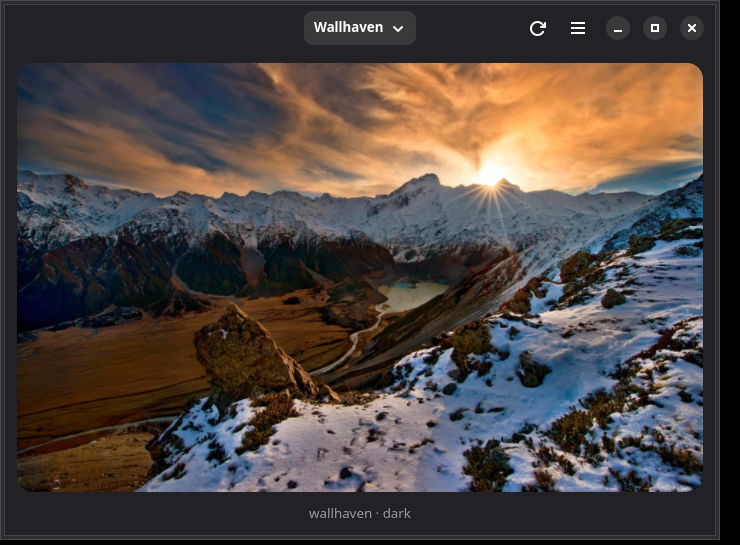
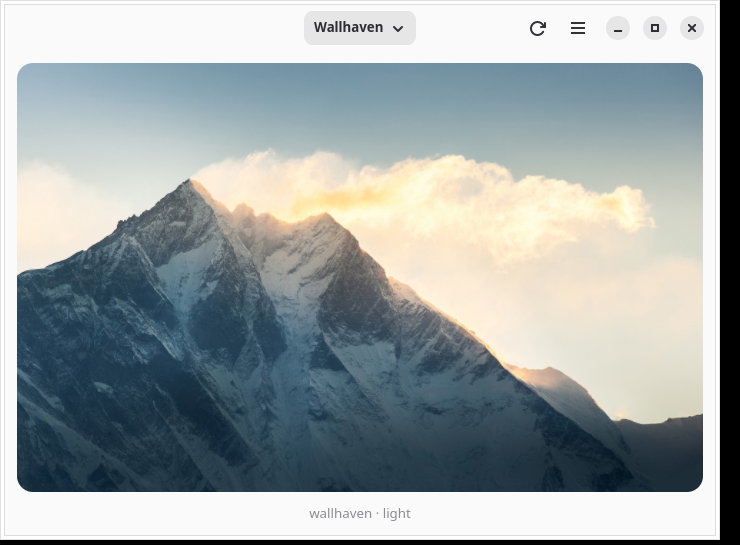

<p align="center">
  
</p>

# Valhalla

A minimal wallpaper application for Linux desktops, inspired by
[Damask](https://gitlab.gnome.org/subpop/damask), written in Rust with GTK 4 and
libadwaita.

Valhalla picks wallpapers from online sources and — most importantly — always
matches them to your desktop's light/dark preference, so dark mode never gets a
blinding white wallpaper.

## Screenshots

<p align="center">
  
  
</p>

## Features

- **Theme-aware selection**: wallpapers are analyzed (average brightness) and
  matched against the desktop color scheme; selection re-runs immediately when
  you switch light/dark mode
- **Sources**: Wallhaven and Unsplash
- **Filters**: tags, categories, purity (SFW/sketchy/NSFW), resolution, aspect
  ratio, sorting
- **API keys** stored in the GNOME Keyring (required for NSFW on Wallhaven and
  for any Unsplash usage)
- **Automatic refresh** on an interval, on theme change, or manually
- **Runs everywhere** the XDG desktop portal does (GNOME, KDE, ...), with a
  direct GSettings fallback on GNOME; sets `picture-uri` and `picture-uri-dark`
  independently so a manual theme flip never shows a mismatched wallpaper
- **Headless daemon** (`valhalla --daemon`) for refreshing without a window,
  plus a systemd user unit

## Building

Development happens in a distrobox/toolbox container (or any distro with the
GNOME stack):

```sh
distrobox enter valhalla
cd ~/Projects/valhalla
cargo build --release
```

Requirements (Fedora, run inside the container):

```sh
sudo dnf install -y rust cargo rustfmt clippy gcc pkgconf-pkg-config \
    gtk4-devel libadwaita-devel libsecret-devel glib2-devel blueprint-compiler git
```

## Running

```sh
cargo run            # GUI
cargo run -- --daemon  # headless wallpaper refresh service
```

To refresh at boot/login without the window, install the systemd user unit:

```sh
cp data/valhalla.service ~/.config/systemd/user/
# adjust ExecStart to point at the binary
systemctl --user daemon-reload
systemctl --user enable --now valhalla.service
```

## Settings

Stored in GSettings (`gsettings list-recursively io.github.tunix.valhalla`),
API keys in the Secret Service (GNOME Keyring).

## License

GPL-3.0